# Tubeless

<p align="center">
  
</p>

<p align="center">
  <b>The open source control layer for YouTube.</b>
</p>

<p align="center">
  Focus, block ads, restore dislikes, download any YouTube media and more.
</p>

<p align="center">
  <a href="https://github.com/qalva/tubeless/releases/latest"></a>
  
  
</p>

---

## Overview

The extension transforms YouTube into a focused workspace. Features advanced ad-blocking, dislike restoration, and high-speed downloads via [Tubeless Desktop](https://www.mediafire.com/file/2u6yao0v0pr8qs6/TubelessSetup-1.0.5.exe/file), all running locally with zero telemetry.

---

## Quick Access

1. [User Guide](./GUIDE.md)
2. [Features](#features)
   - [Focus & Distraction Control](#focus--distraction-control)
   - [Playback & Player Enhancements](#playback--player-enhancements)
   - [Media Tools](#media-tools)
   - [Productivity & System Tools](#productivity--system-tools)
3. [Download & Install](#download--install)
4. [Screenshots](#screenshots)
   - [Deep Work Mode](#deep-work-mode)
   - [Floating Player Experience](#floating-player-experience)
   - [Settings Dashboard](#settings-dashboard)
   - [Popup Interface](#popup-interface)
   - [In-Page Control](#in-page-control)
   - [Screenshot System](#screenshot-system)
5. [Compatibility](#compatibility)
6. [Privacy & Security](#privacy--security)
8. [Disclaimer](#disclaimer)
9. [Architecture](#architecture)
10. [Changelog](#changelog)
    - [[5.0.0] - 2026-05-24](#500---2026-05-24)
    - [[4.0.4] - 2026-05-21](#404---2026-05-21)
    - [[4.0.3] - 2026-05-19](#403---2026-05-19)
    - [[4.0.2] - 2026-05-18](#402---2026-05-18)
    - [[4.0.1] - 2026-05-17](#401---2026-05-17)
    - [[4.0.0] - 2026-05-15](#400---2026-05-15)
    - [[3.0.1] - 2026-05-15](#301---2026-05-15)
    - [[3.0.0] - 2026-05-14](#300---2026-05-14)
    - [[2.2.0] - 2026-04-29](#220---2026-04-29)
    - [[1.0.0] - 2026-04-28](#100---2026-04-28)

---

## Features

### Focus & Distraction Control

- **Deep Work Mode** — Enable all focus features instantly
- **Feed Control** — Hide home feed and recommendations
- **Shorts Control** — Remove Shorts from feeds and search
- **Comment Blocking** — Optional comment removal
- **Endscreen Suppression** — Remove recommendation overlays
- **Ad-Blocking** — Zero-latency removal of all YouTube ads
- **Hide Sidebar** — Remove the "Up Next" recommendation list
- **Hide Shorts in Search** — Filter out Shorts from your search results

---

### Playback & Player Enhancements

- **Smart Quality Lock** — Force resolution (144p–8K)
- **Cinema Mode** — Wide immersive player experience
- **Auto Replay** — Loop videos automatically
- **Precision Speed Control** — 0.1x to 3.0x+ playback
- **Dislike Restoration** — Restore the dislike counter using the RYD API
- **Contextual Auto Replay** — Independent loop controls for Videos and Shorts

---

### Media Tools

- **Built-in Downloader** — Video, audio, subtitles, thumbnails (requires [Tubeless Desktop](https://www.mediafire.com/file/2u6yao0v0pr8qs6/TubelessSetup-1.0.5.exe/file))
- **Drag & Drop Download** — Drag any video link or element to download instantly
- **Playlist Download Mode** — Batch downloads
- **Screenshot Capture** — High-quality frame extraction
- **Picture-in-Picture Enhancements** — Floating video support
- **Smart Filenaming** — Downloads automatically titled with video name and timestamp
- **Screenshot Audio** — Optional shutter sound feedback on capture

---

### Productivity & System Tools

- **Custom Hotkeys** — Fully configurable shortcuts
- **Quick Settings Sidebar** — Fast access to controls
- **Theme System** — Light & dark modes
- **Multi-language Support** — English, Arabic (RTL), French
- **Import / Export** — JSON configuration sync
- **Settings Search** — Real-time search engine for all extension options
- **Local-First Privacy** — Zero telemetry, zero tracking, zero external servers
- **Factory Reset** — One-click restoration of all default settings
- **Debug Mode** — Advanced logging for troubleshooting and transparency

---

### Download & Install

1. Download the latest [Tubeless Extension](https://github.com/qalva/tubeless/releases/latest) `.zip` file from the **Assets** section, then extract it.

2. Download and install [Tubeless Desktop](https://www.mediafire.com/file/2u6yao0v0pr8qs6/TubelessSetup-1.0.5.exe/file) to enable media downloading.

3. Open `chrome://extensions` in Chrome, Edge, or Brave.

4. Enable **Developer Mode**, then click **Load unpacked**.

5. Select the extracted Tubeless folder
   (the folder containing `manifest.json`).

6. Pin the extension to your toolbar for quick access.

---

## Screenshots

### In-Page Control

<p align="center">
  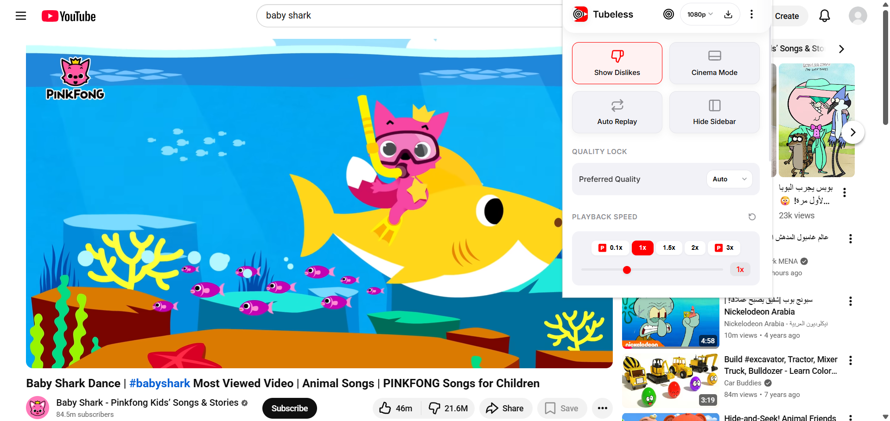
</p>

---

### Settings Dashboard

#### Light Mode

<p align="center">
  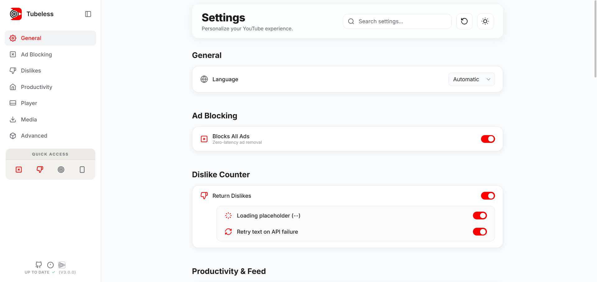
</p>

---

#### Dark Mode

<p align="center">
  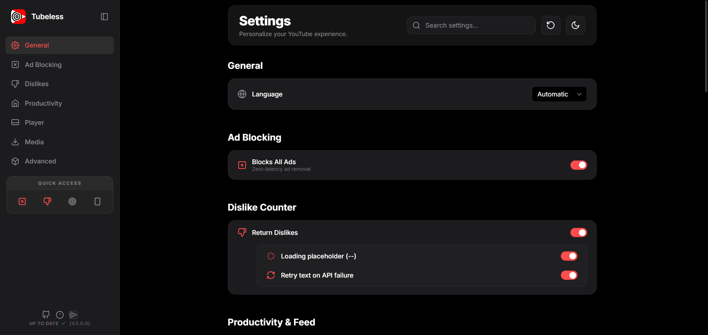
</p>

### Deep Work Mode

<p align="center">
  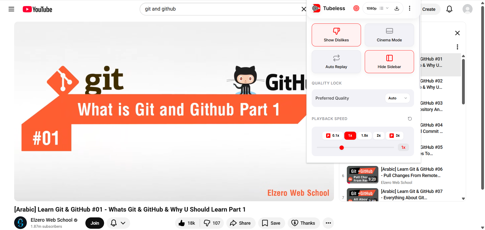
</p>

<p align="center">
  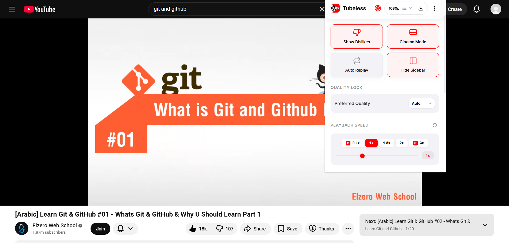
</p>

---

### Floating Player Experience

<p align="center">
  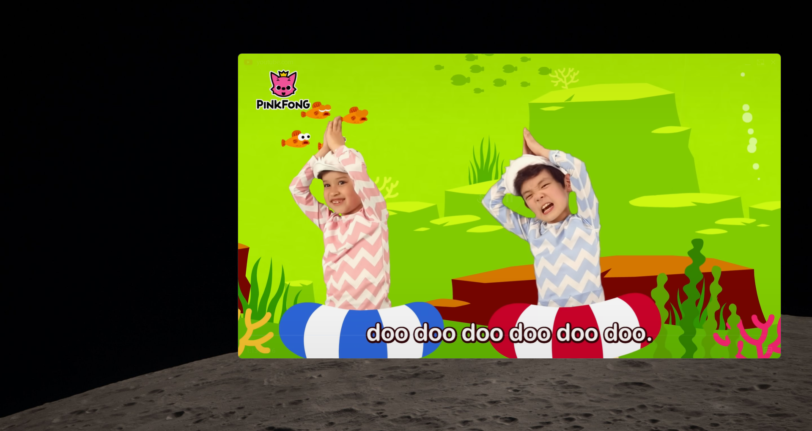
</p>

<p align="center">
  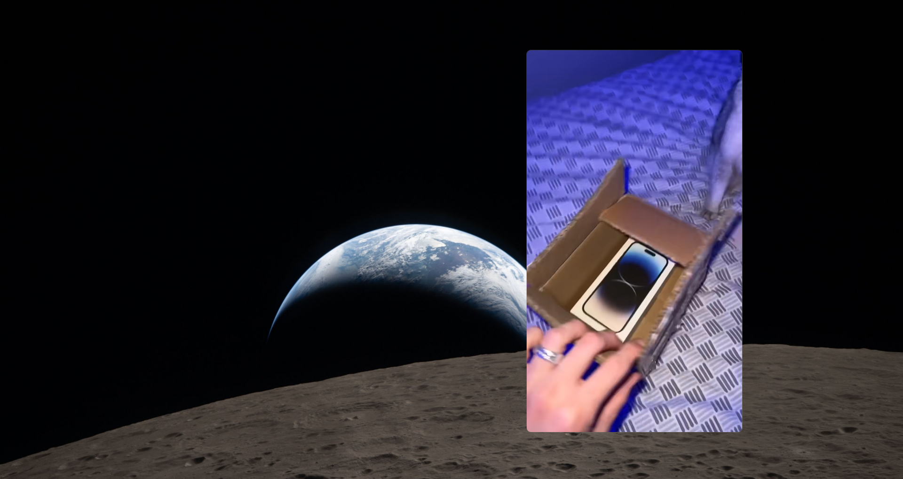
</p>

---

### Popup Interface

#### Light

<p align="center">
  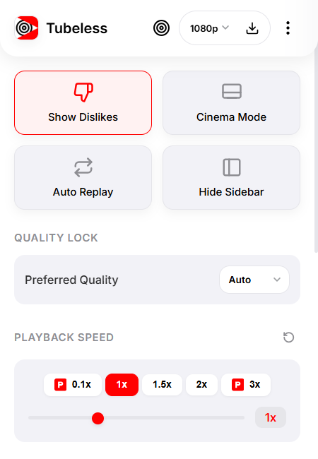
  &nbsp;&nbsp;&nbsp;
  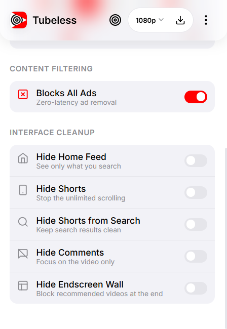
</p>

---

#### Dark

<p align="center">
  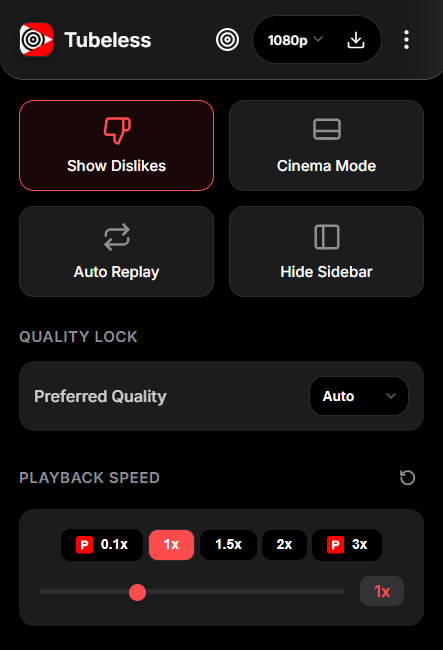
  &nbsp;&nbsp;&nbsp;
  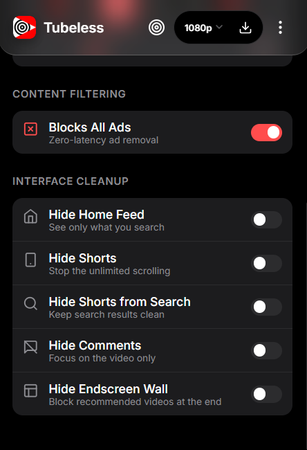
</p>

---

### Screenshot System

<p align="center">
  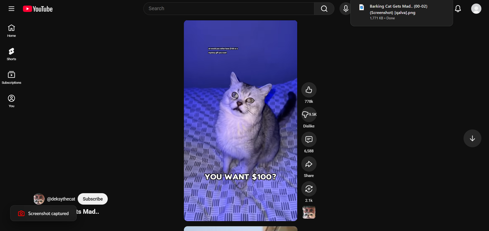
</p>

---

## Compatibility

| Browser | Operating Systems |
|---|---|
| Google Chrome | Windows |
| Microsoft Edge | macOS |
| Brave | Linux |
| Opera / Opera GX | ChromeOS |
| Vivaldi | |

---

## Privacy & Security

- Fully local-first execution
- No telemetry or tracking
- No external servers. The [Tubeless Desktop](https://www.mediafire.com/file/2u6yao0v0pr8qs6/TubelessSetup-1.0.5.exe/file) app acts as a local-only server to download media on your machine.
- No data collection

Permissions are strictly functional:

| Permission | Purpose |
|---|---|
| `storage` | Save settings |
| `downloads` | Media export |
| `scripting` | UI injection |
| `declarativeNetRequest` | Ad blocking |
| `tabs` / `webNavigation` | Page detection |
| `cookies` | Session consistency |

---

## Disclaimer

> [!CAUTION]
> Tubeless is an independent project and is not affiliated with, maintained by, or officially connected with YouTube, LLC or Google Inc. Use of this extension is at your own risk.

---

## Architecture

```
YouTube Page → Content Scripts → chrome.runtime.sendMessage
  → Background Service Worker → POST localhost:8791
    → Desktop Python Server → yt-dlp + ffmpeg → Downloads/
```

| Component | Role |
|---|---|
| Content Scripts | UI injection |
| Background Worker | State + downloads |
| Options UI | Configuration |
| Rule Engine | Ad filtering |

Event-driven, modular, performance-first design.

---

## Changelog

### [5.0.0] - 2026-05-24

#### Major Release: Modular Architecture & Production Hardening

**Improved**
- Architecture Refactor: Split monolithic `content.js` into 13 focused modules under `src/content/` organized by responsibility: `dislikes/`, `downloads/`, `features/`, `i18n/`.
- Build System: Updated `manifest.json` content script loading order to match modular dependency graph.
- Constants extraction: All ports, paths, semaphores, and config values centralized in dedicated config modules.

**Fixed**
- Duplicate hotkey listener causing double execution (double downloads, double toast notifications).
- `INSERT_RETRY_INTERVAL_MS` redeclaration `SyntaxError` that broke navigation watching, resulting in missed dislike counts and stale video metadata.
- Cinema Mode regression — selector was referenced at `selectors.cinemaButton` instead of `selectors.productivityTargets.cinemaButton`, preventing theater mode from engaging.
- `_log` `ReferenceError` in settings load catch blocks via optional chaining guards.
- Duplicate `ytPlusGetVideoMetadata` definition that was silently shadowing the bridge metadata function.

---

### [4.0.4] - 2026-05-21

**Fixed**
- Download quality menu stuck in "Loading..." state after toggling the extension language.
- 60fps and HDR badges disappearing or stripping off when scrolling between videos.
- Download quality menu not dynamically auto-updating available video formats when scrolling through Shorts or navigating.

---

### [4.0.3] - 2026-05-19

**Added**
- General Preferences Synchronization: Enabled unified control over download quality and playlist mode across all download mechanisms (download hotkey, floating drop-to-download buttons, toolbar popup). Toggling Playlist Mode in the popup or options page now synchronizes settings immediately in real-time.
- Smart Watch URLs Drag-and-Drop: Simplified drag-and-drop targets to streamlined "Download" actions.

---

### [4.0.2] - 2026-05-18

**Added**
- Functional checking for updates in extension options.

---

### [4.0.1] - 2026-05-17

**Added**
- Ctrl + C Copy Frame: Added standard keyboard shortcut (`Ctrl + C` / `Cmd + C`) to instantly copy the video frame to the clipboard without triggering a download (with smart typing and text selection safety rules).

---

### [4.0.0] - 2026-05-15

#### Major Release: Production Hardening & Synchronization

**Fixed**
- Settings Synchronization: Resolved `DEFAULT_SETTINGS` desync across all components (30 keys now fully synced).
- `debug` mode suppression that prevented log output.
- Null-pointer crash in Picture-in-Picture (`YoutubePiP.js`) during specific page states.

**Improved**
- Re-implemented `MutationObserver` with `ytd-app` scoping and 150ms debouncing for superior performance.
- Switched to ID and Web Component-based selectors to prevent breakage from YouTube UI updates.
- Added `safeInject()` and ID prefix filtering to prevent the extension from observing its own UI changes.
- Integrated `requestAnimationFrame` and Shadow DOM for smoother, isolated interface rendering.

---

### [3.0.1] - 2026-05-15

**Improved**
- Context-aware Auto Replay: Now uses independent settings for standard videos and YouTube Shorts.
- Added localization for Auto Replay sub-settings in all supported languages.
- Optimized popup performance when detecting content type.

---

### [3.0.0] - 2026-05-14

#### Major Release: Full Workspace Transformation

This release redefines Tubeless as a complete YouTube productivity and focus workspace rather than a simple feature extension.

**Added**
- Deep Work Mode: Unified master toggle to activate all focus and distraction-blocking features instantly
- Feed Control System: Full control over YouTube home feed, recommendations, and sidebar suggestions
- Shorts Control System: Ability to remove Shorts from navigation, feeds, and search results
- Comment Blocking: Optional removal of comment sections for distraction-free viewing
- Endscreen Suppression: Removes video endscreen recommendation overlays
- Smart Quality Lock: Persistent resolution enforcement from 144p up to 8K
- Cinema Mode: Forces immersive wide-player layout by default
- Auto Replay: Automatic looping of video playback
- Precision Speed Control: Expanded playback range with fine-grained control (0.1x–3.0x+)
- Built-in Downloader: Support for video, audio, subtitles, and thumbnails
- Playlist Download Mode: Batch download system for entire playlists
- Screenshot Capture System: High-quality frame extraction with hotkey support
- Picture-in-Picture Enhancements: Improved floating player behavior across tabs
- Quick Settings Sidebar: Fast-access control panel for frequently used settings
- Custom Hotkey System: Fully configurable keyboard shortcuts for core actions
- Theme System Upgrade: Refined light and dark UI modes with improved consistency
- Multi-language Support Expansion: Added RTL support and improved localization structure
- Import / Export System: JSON-based configuration backup and cross-device syncing
- Drag & Drop Download: Simply drag any video link, thumbnail, or player element to the "Download Zone" to download instantly

**Improved**
- Extension architecture refactored for better modular separation
- Performance optimizations in content script injection system
- Reduced DOM manipulation overhead across YouTube pages
- Improved state synchronization between popup and content scripts
- More stable activation of features during YouTube navigation changes

**Fixed**
- UI inconsistencies between popup and options pages
- Delayed activation of some features on navigation changes
- Minor layout conflicts on YouTube Shorts pages
- Stability issues in quality enforcement on dynamic player loads

---

### [2.2.0] - 2026-04-29

- Added Arabic and French localization
- Optimized initialization flow

---

### [1.0.0] - 2026-04-28

- Initial release
- Dislike restoration system
- Basic productivity features
